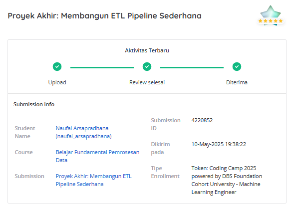

# 🛍️ E-Commerce Product Scraper & ETL Pipeline

Scrape • Clean • Transform • Load  
📦 Built with Python, BeautifulSoup, Pandas, SQLAlchemy

---

## 🚀 Overview

This project automates the process of extracting product data from a simulated e-commerce website, transforming it into a clean format, and loading it into a SQL database. It's designed to simulate a real-world **ETL (Extract, Transform, Load)** pipeline and supports scalable scraping and structured storage for downstream analysis.

---

## 📌 Features

- ✅ **Robust Web Scraping** using BeautifulSoup
- 🔍 Smart error handling for inconsistent HTML structures (like missing prices or ratings)
- 🧹 Data Cleaning & Transformation
- 🧪 Unit Tested Functions with Code Coverage Reporting
- 🛢️ SQL-ready output using Pandas and SQLAlchemy
- ⏱️ Auto-timestamping for data tracking

---

## 🧱 Project Structure

```
📦 project-root/
├── utils/
│   ├── extract.py         # Parses HTML and extracts data
│   ├── transform.py       # Cleans and transforms raw data
│   ├── load.py            # Loads data into SQL DB
├── test/                  # Unit tests
│   ├── test_extract.py    
|   ├── test_load.py
|   ├── test_transform.py
├── main.py                # Main orchestration script
├── requirements.txt       # Python dependencies
└── README.md              # Project documentation
```

---

## 🛠️ Setup & Installation

1. **Clone the repository**
```bash
git clone https://github.com/yourusername/ecommerce-scraper-etl.git
cd ecommerce-scraper-etl
```

2. **Install dependencies**
```bash
pip install -r requirements.txt
```

3. **Run the pipeline**
```bash
python main.py
```

---

## 🧪 Testing

This project includes unit tests for core components.  
To run tests and see code coverage:

```bash
python -m pytest tests
pytest --cov=utils --cov-report=term-missing tests
```

---

## 🧩 Example Output

Here's an example of the structured output saved to the database:

| title             | price   | rating           | colors    | size | gender | timestamp           |
|------------------|---------|------------------|-----------|------|--------|---------------------|
| Unknown Product  | $100.00 | Invalid Rating   | 5 Colors  | M    | Men    | 2025-05-15 11:00:00 |
| Pants 46         | None    | Not Rated        | 8 Colors  | S    | Men    | 2025-05-15 11:00:01 |

---

## 📚 Technologies Used

- Python 3.10+
- BeautifulSoup4
- Requests
- Pandas
- SQLAlchemy
- SQLite (default, can be swapped with PostgreSQL/MySQL)
- Pytest

---

## 💡 Future Improvements

- Asynchronous scraping with `aiohttp` for speed
- Integration with cloud-based DBs (e.g., Google BigQuery)
- Auto-scheduling with Airflow or cron
- Export to CSV/Excel

---

## Notes!
I deleted the google-sheets-api.json because it contain a secret key of my Google Console API Service. In this repository, you will also only find a load function to a CSV file, but actually I did load to 3 types of data repository.

---

## Accepted Submission Evidence


---

## 🧑‍💻 Author

Created with ❤️ for the **DBS Coding Camp 2025**  
Feel free to fork, contribute, or suggest improvements!
